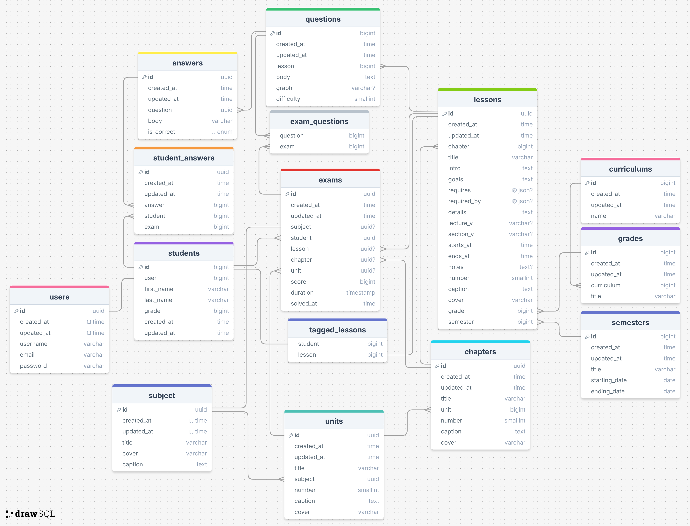

# PLATED - Educational Platform


PLATED is a web application designed to provide educational services to secondary school students in Egypt. Built using the Django framework, it offers a comprehensive learning platform tailored to the needs of students in the secondary stage.

## Features

- **Student Registration and Authentication:** Secure sign-up and login processes for students, ensuring personalized access to the platform.
- **Curriculum Management:** Structured content delivery, categorized by subjects, units, chapters, and lessons.
- **Interactive Exams:** Customizable exams with automatic grading and feedback, allowing students to assess their understanding.
- **Progress Tracking:** Tools for students to monitor their progress and identify areas for improvement.
- **Resource Library:** A repository of educational resources, including notes, videos, and external links.

## Installation

To get started with PLATED on your local machine:

1. Clone the repository:
   ```bash
   git clone https://github.com/ibrahimmurad/plated.git

2. Nagigate to the project directory:
   ```bash
   cd plated

3. Create and activate a virtual environment:
   ```bash
   python -m venv env
   source venv/bin/activate  # On Windows use `venv\Scripts\activate`

4. Install the required dependencies:
   ```bash
    pip3 install -r requirements.txt

5. Apply migrations:
   ```bash
   python manage.py migrate

6. Run the development server:
    ```bash
    python manage.py runserver

## Usage

### For Developers

To run the development server, navigate to the project directory and execute the following command:

```bash
python manage.py runserver
```

The server will start running on `http://127.0.0.1/` by default.

### Superuser Account

To create a superuser account, run the following command and follow the prompts:

```bash
python manage.py createsuperuser
```

You can then access the Django admin panel at `http://127.0.0.1/admin/` to manage the application's data.

You can add subjects, units, chapters, lessons, questions adn their answers, and resources through the admin panel to populate the platform with educational content.

### For Students

Students can register for an account on the platform and access the available content. They can view the curriculum, take exams, and track their progress through the student dashboard.

Note: This is a prerelease version of the application, and resources are not completed yet.
Once it is completed, the application will be deployed to a live server.

## Technologies

- **[Django](https://www.djangoproject.com/):** A high-level Python web framework that encourages rapid development and clean, pragmatic design.
    - **[Crispy Forms](https://django-crispy-forms.readthedocs.io/en/latest/):** A Django application that lets you easily build, customize, and reuse forms using your favorite CSS framework.
    - **[Crispy-Bootstrap4](https://django-crispy-forms.readthedocs.io/en/latest/crispy_tag_forms.html#bootstrap-4):** A Django application that lets you easily build, customize, and reuse forms using the Bootstrap 4 CSS framework.
    - **[Django-nested-admin](https://github.com/theatlantic/django-nested-admin):** A Django package that allows you to nest inline forms in the Django admin.
    - **[Pillow](https://python-pillow.org/):** A Python Imaging Library (PIL) fork that adds support for opening, manipulating, and saving many different image file formats.
    - **[Matplotlib](https://matplotlib.org/):** A comprehensive library for creating static, animated, and interactive visualizations in Python.
- **[SQLite](https://www.sqlite.org/index.html):** A C-language library that implements a small, fast, self-contained, high-reliability, full-featured, SQL database engine.
- **[Bootstrap](https://getbootstrap.com/):** An open-source CSS framework directed at responsive, mobile-first front-end web development.
- **[JQuery](https://jquery.com/):** A fast, small, and feature-rich JavaScript library that simplifies HTML document traversing, event handling, animating, and Ajax interactions.
- **[Font Awesome](https://fontawesome.com/):** A font and icon toolkit based on CSS and LESS.
- **[mathjax](https://www.mathjax.org/):** A JavaScript display engine for mathematics that works in all browsers.


## Roadmap

- [x] Create the project structure and set up the Django environment.
- [x] Implement the user authentication system.
    - [x] Create the student registration and login forms.
    - [ ] Create the teacher registration and login forms.
- [x] Design the database schema and create the models.
    - [x] Define curriculum, grade, and semester.
    - [x] Define the subject, unit, chapter, lesson, question, and answer.
    - [x] Define the student, exam, and student_answers.
    - [ ] Define the teacher, classes, and teacher's version of resources.
- [x] Develop the resources management system.
    - [x] Create the resource library.
    - [ ] Implement the teacher's version of the resource library.
- [x] Implement the interactive exams feature.
    - [x] Create the exam form.
    - [x] Add the exam results page.
    - [x] Create randomized questions exams.
    - [x] Implement the exam grading system.
    - [x] Add feedback to the exam results.
- [x] Create the home page for the student.
- [x] Create the dashboard for the student.
- [ ] Create the dashboard for the teacher.
- [ ] Add more functionality (client-side) to the application.
- [ ] Improve the style of the application.
- [ ] Refactor some areas of the code to increase readability and abstraction.
- [ ] Complete the educational content.
- [ ] Deploy the application to a live server.


## Structure

### Database Schema

The database schema consists of the following models:

1. **Curriculum**:
    - **Curriculum:** The curriculums.
    - **Grade:** The grades of the curriculum.
    - **Semester:** The semesters.
2. **Subjects**:
    - **Subject:** The subjects.
    - **Unit:** The units of the subject.
    - **Chapter:** The chapters of the unit.
    - **Lesson:** The lessons of the chapter.
3. **Questions**:
    - **Question:** The questions of the lesson.
    - **Answer:** The answers of the question.
4. **Users**:
    - **User:** The users of the application.
    - **Student:** The students users of the application.
5. **Exams**:
    - **Exam:** The exam of the students.
    - **StudentAnswer:** The student's answer to the question in the exam.

The database schema in the database is as follows:




### Project Structured

1. **[curriculum app](plated/curriculum/)**:
    - Contains Curriculum, Grade, and Semester models, and CURRENT_SEMESTER module level variable.
    - contains context_processors.py file that adds the CURRENT_SEMESTER variable to the context.
2. **[subjects app](plated/subjects/)**:
    - Contains Subject, Unit, Chapter, and Lesson models.
    - Contains the views and templates for the resources navigation.
3. **[questions app](plated/questions/)**:
    - Contains Question and Answer models.
4. **[users app](plated/users/)**:
    - Contains User and Student models.
    - Register, Login, Logout, Settings, changePassowrd, and ResetPassword views and tempaltes.
5. **[exams app](plated/exams/)**:
    - Contains Exam and StudentAnswer models.
    - Contains the views and templates for the exams.
6. **[home](plated/home/)**:
    - Contains the view and the template for the home page.
7. **[dashboard](plated/dashboard/)**:
    - Contains the views and the templates for the student dashboard.

## Contributing

Contributions are welcome! If you'd like to contribute to PLATED, please fork the repository and create a pull request. For major changes, please open an issue first to discuss what you would like to change.

## License

This project is licensed under the MIT License - see the [LICENSE](LICENSE) file for details.

## Contact

- Ibrahim Murad - [ibrahimmorad31@gmail.com](mailto:ibrahimmorad31@gmail.com)

## Support

Give a ⭐️ if you like this project!


## release notes

-  v0.5.0-alpha: Initial release of the project. It was a graduation project for ALX-SE program.
It will be debrecated soon and a new version will be released with more features and better design.
The new vesion aims to have separete back-end and front-end, and to be deployed to a live server.
The back-end will be a new django project with more models and features, and it will serve as a RESTfull API server using django-rest-framework.
The front-end will be a react project.

- v0.6.0-alpha: comming...
